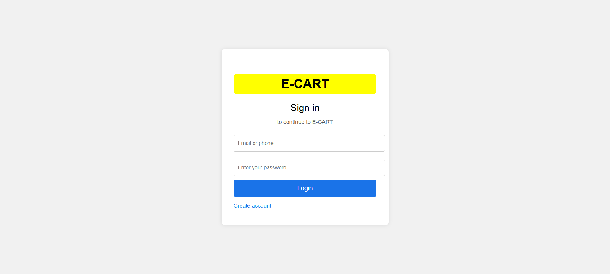
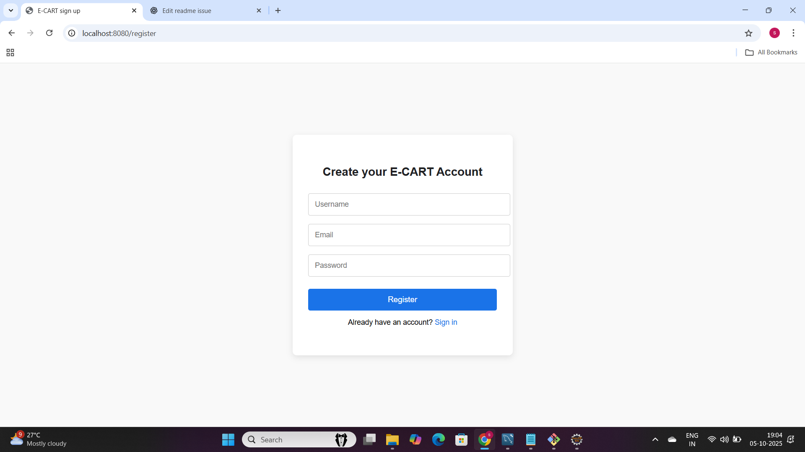
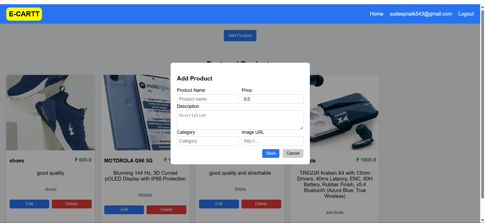
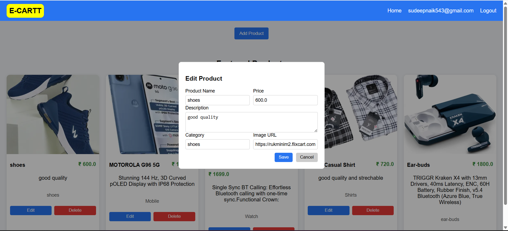

# 🛒 ECOMMERCE Project - Internship Task

## 📌 Overview

This project is part of my internship task. It demonstrates a **full stack E-commerce application** with user authentication, product management (CRUD), backend API integration, and frontend UI.

---

## 🚀 Features

* **User Authentication** (Login & Registration with session-based auth)
* **Product Management (CRUD)**

  * Add, Edit, Delete, and View products
  * Products include name, description, price, category, and image
* **REST API** built with Spring Boot
* **Frontend** (HTML/CSS/JS)
* **Database**: MySQL

---

## 🛠️ Tech Stack

* **Backend:** Java, Spring Boot, Spring Security,Spring-Jpa
* **Frontend:** HTML, CSS, JavaScript, Bootstrap
* **Database:** MySQL
* **Build Tool:** Maven

---

## 📂 Folder Structure

```
ECOMMERCE/
│── src/
│   ├── main/java/com/sandy/controller/   # Controllers
│   ├── main/java/com/sandy/entity/       # Entities
│   ├── main/java/com/sandy/repository/   # Repositories
│   ├── main/java/com/sandy/service/      # Services
│   ├── main/resources/templates/         # HTML templates
│   └── main/resources/static/            # CSS/JS/Images
│── pom.xml
│── README.md
```

---

## ⚙️ Setup Instructions

1. Clone the repository:

   ```bash
   git clone https://github.com/SandeepNaki12/fullstack-internship-task.git
   ```
2. Open in **Eclipse / IntelliJ**.
3. Configure database in `application.properties`.
4. Run the Spring Boot app.
5. Open in browser: `http://localhost:8080`.

---

## 🖼️ Screenshots

| Feature        | Screenshot                              |
| -------------- | --------------------------------------- |
| Login Page     |        |
| Register Page  |  |
| Add Product    |            |
| Edit Product   |          |
| Delete Product |      |

---

## 📧 Submission

Sandeep Naik
